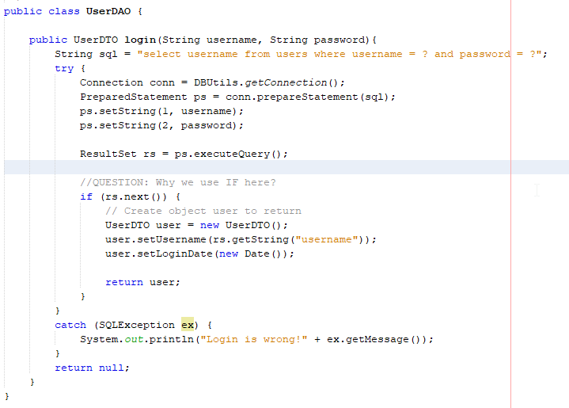
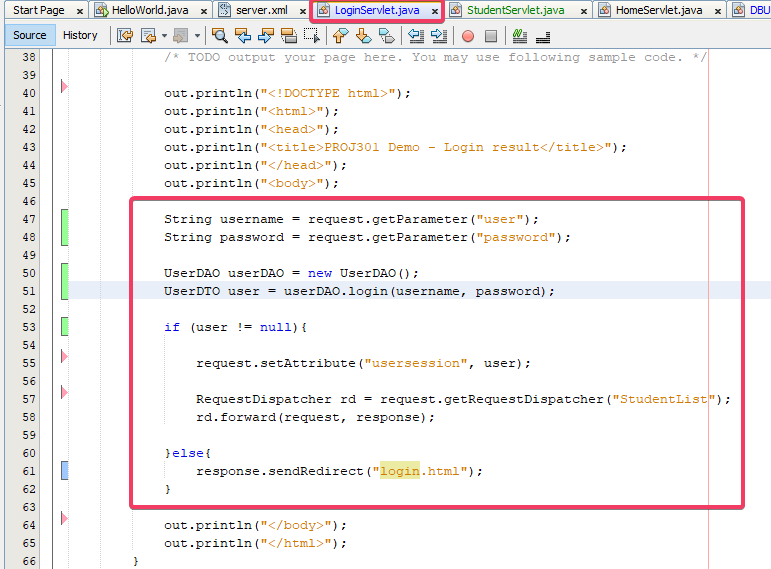
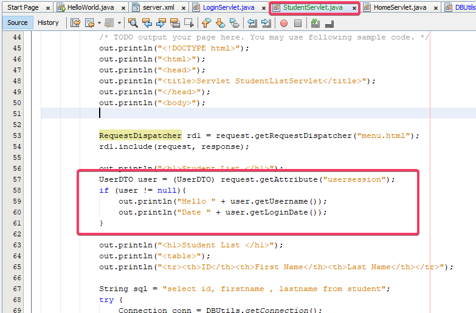
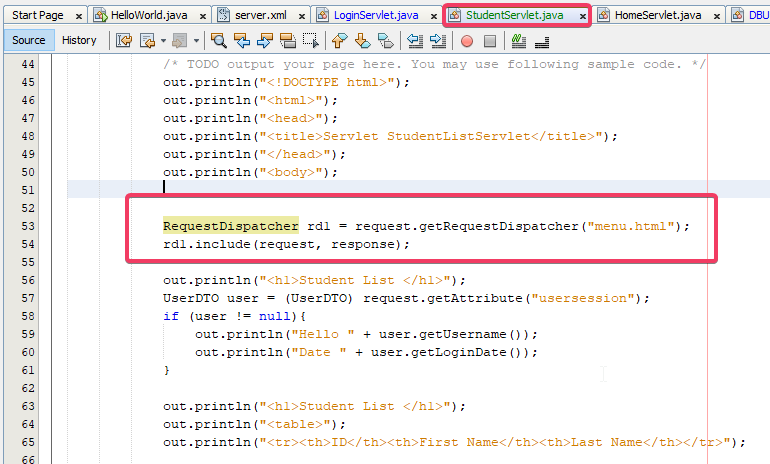

# Exercise 3

## Milestone 12: Develop Login function and direct to Student List page

- Pull the prj301-demo3. 
- Create new table `users` for checking user login

```
USE prj301;

CREATE TABLE users (
    username VARCHAR(100) PRIMARY KEY,
    name VARCHAR(100),
    password VARCHAR(30)
    
);

INSERT users (username, password, name) VALUES
('dung','dung','Huynh Dung');

INSERT users (username, password, name) VALUES
('nam','nam','Nguyen Nam');
```

- Develop UserDAO and UserDTO to query database for login. 



- Use the method UserDAO.login in LoginServlet to check username/password. If the username/password is correct, forward to page StudentList. If not, redirect to page login.html



- Show username in StudentList using attribute




- Include menu for page StudentList



- Take screenshoots of your code and web application

## Milestone 13: Develop StudentDAO and StudentDTO

- Create a new package com.fptuni.prj301.demo.Student and two classes StudentDAO and StudentDTO

- Create attributes of StudentDTO, setter and getter

```
private Long id = null;
private String firstName = null; 
private String lastName= null;
```

- In StudentDAO, develop method `list` which query students in database

```
public List<Student> list(String keyword ){
        
        ArrayList<Student> list;
        list = new ArrayList<Student>();
        
		// your code
		//

		while (rs.next()){
        	list.add(new Student (
					rs.getInt("id"),
					rs.getInt("firstname"),
					rs.getInt("lastname")
			);
        }

		// your code
		//


        return list;
}
```

- In StudentServlet, using StudentDAO.list to print Student table.

- Take screenshoots of your code and web application


