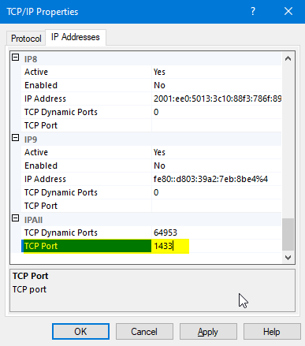

# Support issues in Netbeans, Tomcat

## 3. Can not run program "cmd"

Symtom:
Cannot run program "cmd" (in directory
when build program Maven

Solution:
No need to downgrade the JDK, just add this in your `netbeans.conf`

Find your `netbeans.conf` file. e.g.: `netbeansIstallDir/etc/netbeans.conf`

Find the key netbeans_default_options and at the start of the string add the following: `-J-Djdk.lang.Process.allowAmbiguousCommands=true`

It should look like this:
```
netbeans_default_options="-J-Djdk.lang.Process.allowAmbiguousCommands=true..."
```
https://stackoverflow.com/questions/58445540/netbeans-9-10-11-cannot-run-program-cmd

## 2. Enable sa account in SQL Server

When install SQL Server, you forget to enable sa account. Follow this link to enable sa account

https://sudeeptaganguly.wordpress.com/2010/04/20/how-to-enable-sa-account-in-sql-server/

## 1. Can not connect Demo to SQL Server using JDBC
Keyword: SQL, JDBC

### Symtom:
Error message:
The TCP/IP connection to the host localhost, port 1433 has failed. Error: "connect timed out. Verify the connection properties


### Solution:

Check this link and update Port
**Have you enabled 'Named Pipes' and 'TCP/IP'?**
1. Open the 'Sql Server Configuration' application.
2. In the left pane, go to 'SQL Server Network Configuration' -> 'Protocols for [instance-name]'
3. Right-click on both 'Named Pipes' and 'TCP/IP' and select 'enable'.

**Have you used the correct port?**
1. Double-click on 'TCP/IP'
2. Select 'IP Addresses' tab
3. Scroll to IPAII. Your port number is here. Should be 1433
4. Restart the 'SQL Server ([instance-name])' windows service.



** If you use many instances od MS SQL SEVER**
Make sure the SQL Server Browser windows service is running

Read this link if you use many instance https://stackoverflow.com/questions/12523865/jdbc-simple-mssql-connection-example-not-working
